# Progetto programmazione avanzata: backend per il gioco scacchi
Progetto per il corso di programmazione avanzata A.A. 2021/2022 presso UNIVPM
<a></a>

## 📄 Specifica e obiettivi del progetto
Si realizzi un sistema che consenta di gestire il gioco di scacchi. In particolare, il sistema deve prevedere la 
possibilità di far interagire due utenti (autenticati mediante JWT) o un utente (sempre autenticato con JWT) 
che gioca contro l’intelligenza artificiale. Ci possono essere più partite attive in un dato momento. Un utente può allo stesso tempo partecipare ad una ed una sola partita.

La specifica completa è consultabile nel seguente [documento](specifiche.pdf)

## 📦 Strumenti per lo sviluppo

- [Node.JS](https://nodejs.org)
- [Express](https://expressjs.com)
- [Sequelize](https://sequelize.org) 
- [MySQL](https://www.mysql.com)
- [Js-chess-engine](https://www.npmjs.com/package/js-chess-engine)
- [Docker](https://www.mysql.com)
- [Postman](https://www.postman.com)
- [JWT](https://jwt.io)

## 👩‍💻 Installazione

### Requisiti 
L'unico requisito per installare l'applicazione è [Docker](https://www.mysql.com).
Per testare l'applicazione invece viene utilizzato il client API [Postman](https://www.postman.com).

### Avvio del progetto

1. Clonare la repository con il comando:
    ```
    git clone https://github.com/denilnicolosi/Progetto_pa
    ```

2. Generare l'immagine docker dell'applicazione con il seguente comando
    ```
    docker-compose build 
    ```

3. Avviare il compose docker costituito dal container dell'applicazione e dal container di MySQL
    ```
    docker-compose up
    ```
4. Aprire postman e caricare la seguente [collection](https://www.getpostman.com/collections/6a44c916b44bfd61ce63)

## 🔧 Configurazione
Per la configurazione dell'applicazione è possibile agire su diverse impostazioni:

### File env
Nel file ```.env``` vengono impostate le variabili d'ambiente che dovrebbero restare segrete. Generalmente questo file non viene condiviso insieme al codice proprio perché potrebbe contenere informazioni sensibili. In questo caso è stato condiviso comunque per agevolare la fase di installazione.
Il file contiene le seguenti informazioni:
```
MYSQL_ROOT_PASSWORD=password
MYSQL_USER=user
MYSQL_PASSWORD=password
MYSQL_DATABASE=chess
MYSQL_ALLOW_EMPTY_PASSWORD=yes

SECRET_KEY=oisjfoviu4nt5549vdfij
DB_NAME=chess
DB_USER=root
DB_PASSWORD=password
DB_HOST=dbmysql
DB_PORT=3306
```
La prima sezione di variabili viene utilizzata dal container mysql per creare gli utenti e il database da utilizzare. La seconda sezione viene utilizzata dal container di nodejs per utilizzare la secret key per la generazione del jwt e le credenziali di accesso al database.


### File docker-compose
Per la configurazione dei container si utilizza il file ```docker-compose.yml``` cosi composto:
```
version: '3.7'

services:
  dbmysql:
    container_name: dbmysql
    image: mysql
    restart: always
    env_file:
      - .env
    ports:
      - '3306:3306'  
    volumes: 
      - ./sqlscript_seed.sql:/docker-entrypoint-initdb.d/script.sql
  app:
    container_name: appnode
    #restart: always
    depends_on:
      - dbmysql 
    build: app/
    env_file:
      - .env   
    ports:
      - 443:3000
    volumes:
      - ./app/src:/home/node/app/src/
```
In questo file si può modificare il mapping delle porte del database (nel caso in cui la porta 3306 sia già impegnata nell'host in utilizzo) o la porta di accesso al servizio API (che in questo caso viene mappata dalla porta 3000 del container alla porta 80 della macchina host)
Inoltre viene specificato il bind dello storage del container alla macchina host, per avere a disposizione il codice sorgente.

### File sqlscript_seed
Nel file ```sqlscript_seed.sql``` viene specificata la struttura del database da creare al primo avvio del container. Vengono anche precaricati dei dati per consentire un utilizzo di prova dell'applicazione, quindi in caso di configurazione possono essere modificati direttamente in questo file. 

### File selfsigned.crt e selfsigned.key
Nella repo sono presenti all'interno della cartella app/certs i file generati da noi relativi al certificato x509 e alla chiave privata per abilitare HTTPS. È importante sottolineare che, in uno scenario di utilizzo reale, la chiave privata va mantenuta segreta e non esposta pubblicamente come in questo caso dove è stato fatto unicamente ai fini di semplificare la fase di test da parte del docente.

## 💻 Utilizzo
Tutte le rotte necessitano come corpo della richiesta un oggetto JSON con i parametri. Per ogni rotta in seguito è specificato il funzionamento e i parametri di cui ha bisogno.
### /login 
- Metodo: ```POST```
- Autenticazione JWT: ```NO```
- Ruolo utente: ```player/admin```
- Parametri obbligatori:
  - ```email``` : Email dell'utente 
  - ```password``` : Password dell'utente
- Parametri facoltativi: ```/```
- Formato risposta: ```application/json```
- Descrizione:

Esempio:

<a>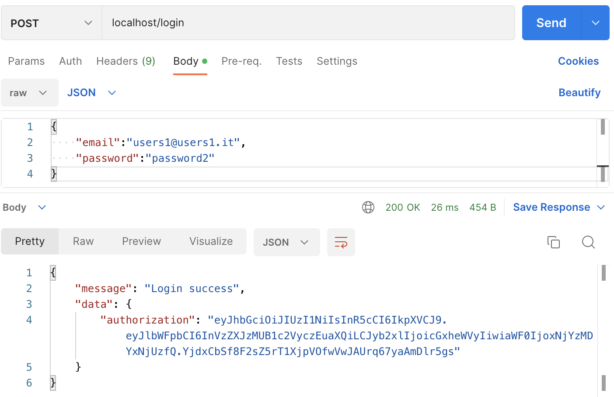</a>

### /newgame     
- Metodo: ```POST```
- Autenticazione JWT: ```SI```
- Ruolo utente: ```player```
- Parametri obbligatori: 
  - ```vs``` : Email del giocatore 2 oppure la stringa ```"AI"``` per giocare contro l'intelligenza artificiale. Il livello di quest'ultima viene specificato mossa per mossa al momento dell'inoltro di una mossa dell'utente alla partita. Il livello viene utilizzato dall' AI per calcolare la risposta.
- Parametri facoltativi: ```/```
- Formato risposta: ```application/json```
- Descrizione: Creazione di una nuova partita 

Esempio:

<a>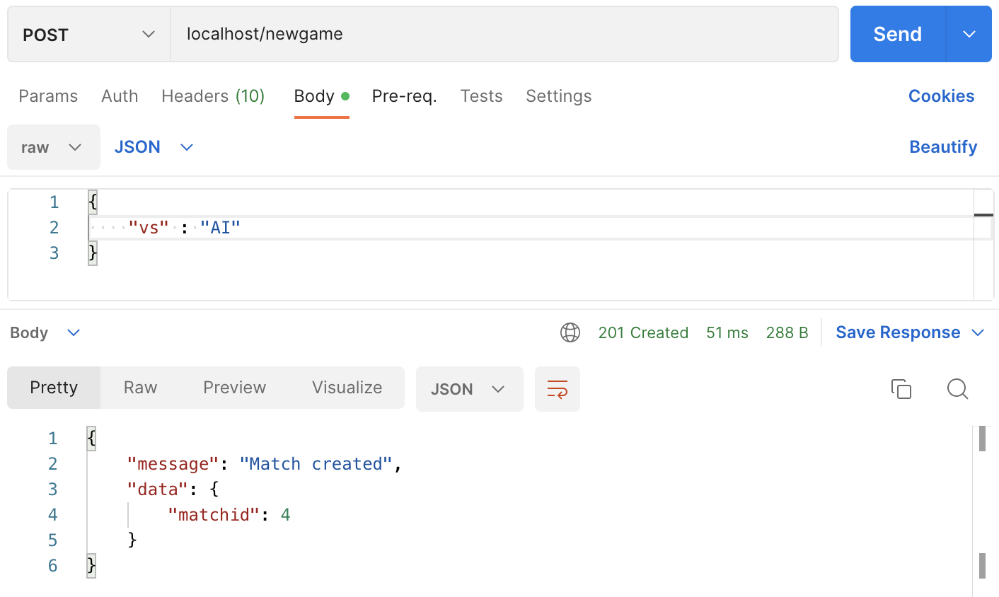</a>

### /move 
- Metodo: ```POST```
- Autenticazione JWT: ```SI```
- Ruolo utente: ```player```
- Parametri obbligatori: 
  - ```level``` : livello dell'AI per calcolare la sua mossa successiva(obbligatorio solo per partite contro AI)
  - ```moveFrom``` : posizione di partenza sulla scacchiera
  - ```moveTo``` : posizione di destinazione
- Parametri facoltativi: ```/```
- Formato risposta: ```application/json```
- Descrizione: Esegue una mossa dalla casella di partenza a quella di destinazione. Se si sta giocando una partita contro AI allora va specificato anche il livello della mossa di risposta da parte del programma

Esempio:

<a></a>


### /playedmatch 
- Metodo: ```GET```
- Autenticazione JWT: ```SI```
- Ruolo utente: ```player```
- Parametri obbligatori: 
  - ```dateFrom``` : data di partenza del filtro (AAA-MM-GG)
  - ```dateTo``` : data di arrivo del filtro (AAA-MM-GG)
- Parametri facoltativi: ```/```
- Formato risposta: ```application/json```
- Descrizione: Ritorna la lista di partite giocate dall'utente nell'intervallo temporale specificato dalle due date passate nel body.

<a>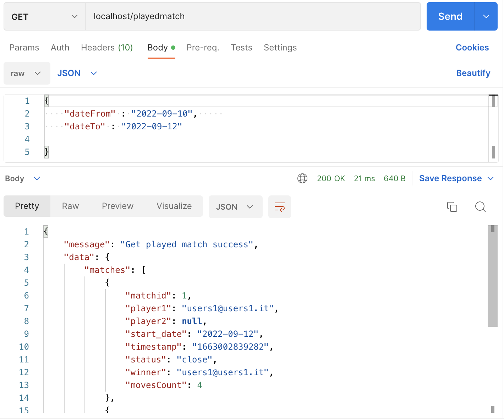</a>


### /statusmatch 
- Metodo: ```GET```
- Autenticazione JWT: ```SI```
- Ruolo utente: ```player```
- Parametri obbligatori: 
  - ```matchId``` : id della partita per la quale si vuole ottenere lo stato
- Parametri facoltativi: ```/```
- Formato risposta: ```application/json```
- Descrizione: Ritorna lo stato della partita specificata come parametro

<a>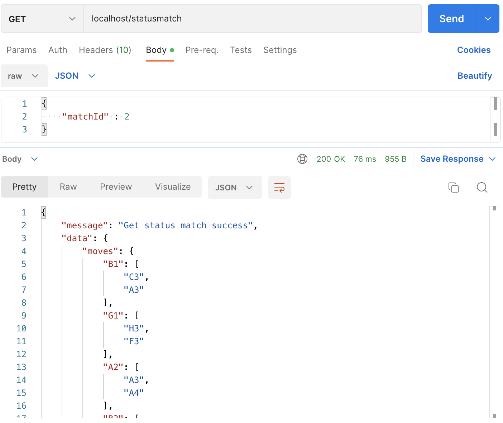</a>

### /historymoves
- Metodo: ```GET```
- Autenticazione JWT: ```SI```
- Ruolo utente: ```player```
- Parametri obbligatori: 
  - ```matchId``` : id della partita per la quale si vuole ottenere lo storico delle mosse
  - ```type``` : specifica il formato della board configuration associata ad ogni mossa, può assumere due diversi valori:
    - ```JSON``` : ritorna la board configuration dopo ogni mossa in formato JSON
    - ```FEN``` : ritorna la board configuration dopo ogni mossa in formato FEN
- Parametri facoltativi: ```/```
- Formato risposta: ```application/json```
- Descrizione: Ritorna lo storico delle mosse della partita specificata come parametro, il formato della board configuration può essere specificato in fase di richiesta. NB ogni partita include una prima mossa di configurazione che ha i valori di from e to settati a null.

<a>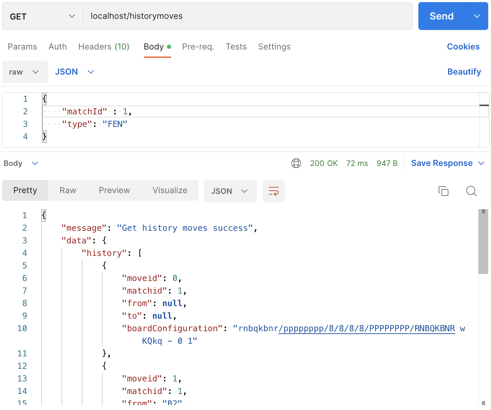</a>

### /playersrank 
- Metodo: ```GET```
- Autenticazione JWT: ```NO```
- Ruolo utente: ```guest```
- Parametri obbligatori: 
  - ```order``` : assume due valori possibili:
    - ```asc``` : ordina la lista dei giocatori per numero di vittorie in formato ascendente
    - ```desc```: ordina la lista dei giocatori per numero di vittorie in formato discendente
- Parametri facoltativi: ```/```
- Formato risposta: ```application/json```
- Descrizione: Ritorna la classifica dei giocatori per numero di partite vinte secondo l'ordinamento specificato

<a></a>

### /token
- Metodo: ```GET```
- Autenticazione JWT: ```SI```
- Ruolo utente: ```player```
- Parametri obbligatori: ```/```
- Parametri facoltativi: ```/```
- Formato risposta: ```application/json```
- Descrizione: Ritorna la quantità di token del giocatore che ne fa richiesta

<a>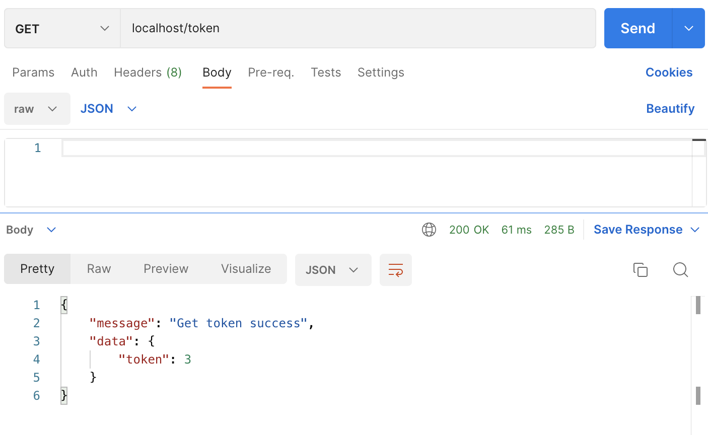</a>

### /token       
- Metodo: ```PUT```
- Autenticazione JWT: ```SI```
- Ruolo utente: ```admin```
- Parametri obbligatori: 
  -```email``` : utente sul quale vanno accreditati i token
  -```token``` : numero di token da assegnare all'utente
- Parametri facoltativi: ```/```
- Formato risposta: ```application/json```
- Descrizione: Assegna un quantitativo di token ad un certo utente

<a>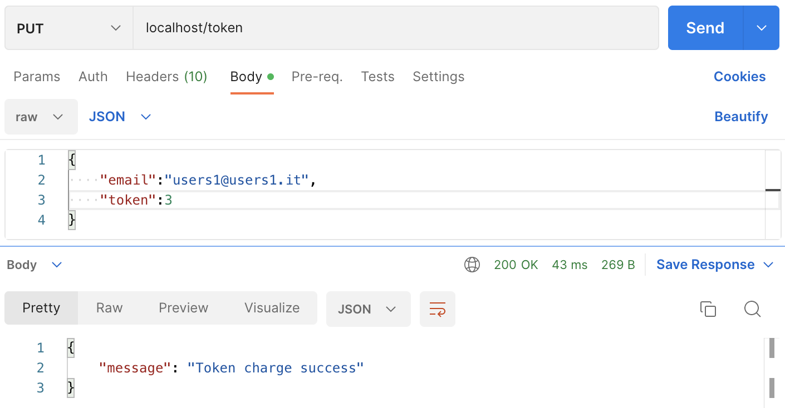</a>

### /endmatch    
- Metodo: ```PUT```
- Autenticazione JWT: ```SI```
- Ruolo utente: ```player```
- Parametri obbligatori: ```/```
- Parametri facoltativi: ```/```
- Formato risposta: ```application/json```
- Descrizione: Nel caso l'utente che esegue questa richiesta ha una partita aperta contro l'IA la partita viene chiusa. Nel caso in cui l'utente ha una partita aperta contro un altro utente ed è il primo ad eseguire questa richiesta la partita viene posta in uno stato di closed_request e se l'altro utente esegue a sua volta questa rotta la partita viene chiusa definitivamente. NB non è possibile passare dallo stato di closed_request ad open

<a>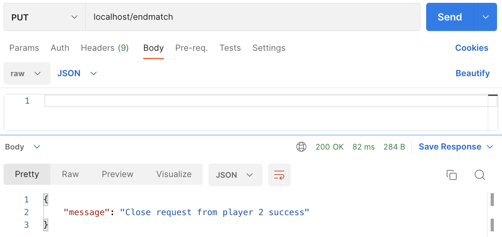</a>

## 📑 Progettazione


### ✈️ Rotte

| Rotta              | Metodo | Descrizione                                                                           | Ruolo utente     | Autenticazione JWT |
| ------------------ | ------ | ------------------------------------------------------------------------------------- | ---------------- | ------------------ |
| /login             | POST   | Accesso con email e password per ottenere il token di autenticazione JWT              | player/admin     | NO                 |
| /newgame           | POST   | Creazione di una nuova partita                                                        | player           | SI                 |
| /move              | POST   | Esecuzione di una mossa in una data partita                                           | player           | SI                 |
| /playedmatch       | GET    | Visualizza le partite eseguite dal giocatore                                          | player           | SI                 |
| /statusmatch       | GET    | Ottiene un JSON contenente lo stato di una data partita                               | player           | SI                 |
| /historymoves      | GET    | Visualizza la cronologia delle mosse della partita                                    | player           | SI                 |
| /playersrank       | GET    | Ottiene un JSON con la classifica dei giocatori che hanno vinto più partite           | guest            | NO                 |
| /token             | PUT    | Ricarica l'importo dei token di un determinato giocatore                              | admin            | SI                 |
| /token             | GET    | Visualizza l'importo residuo dei token                                                | player           | SI                 |
| /endmatch          | PUT    | Conclude una partita. Se la partita è tra due player deve essere eseguita da entrambi | player           | SI                 |

Tutte le richieste sono in json

### Diagrammi UML
#### Casi d'uso

<a>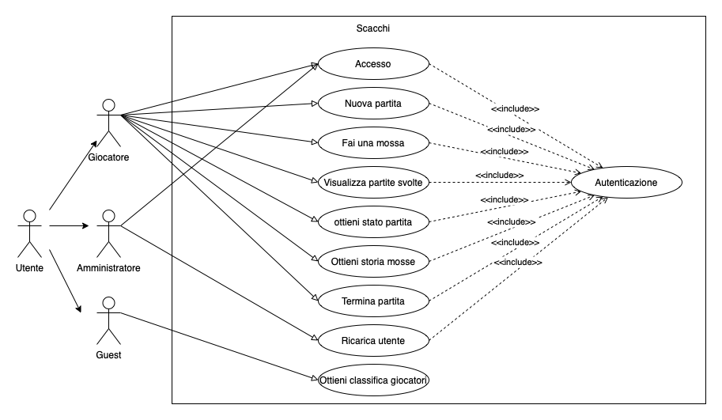</a>

#### ```/login ```
Nel caso di successo: 

<a></a>

Nel caso di errore:

<a></a>
     
#### ```/newgame``` 
Nel caso di successo: 

<a></a>

Nel caso di errore:

<a>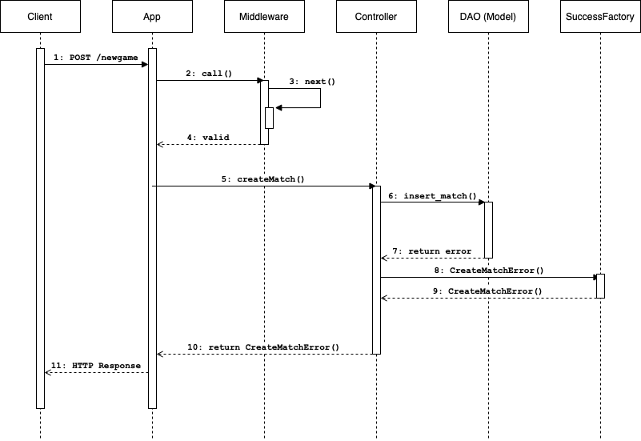</a>

#### ```/move```      

Nel caso di successo: 

<a>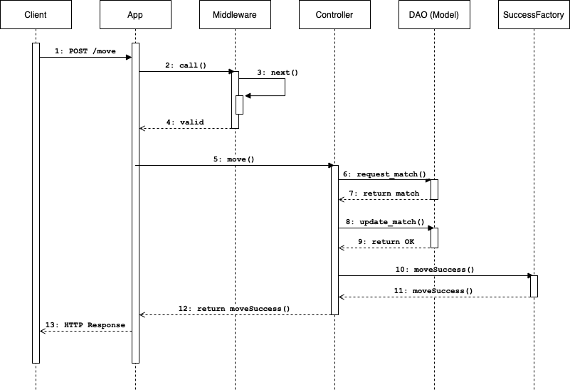</a>

Nel caso di errore:

<a>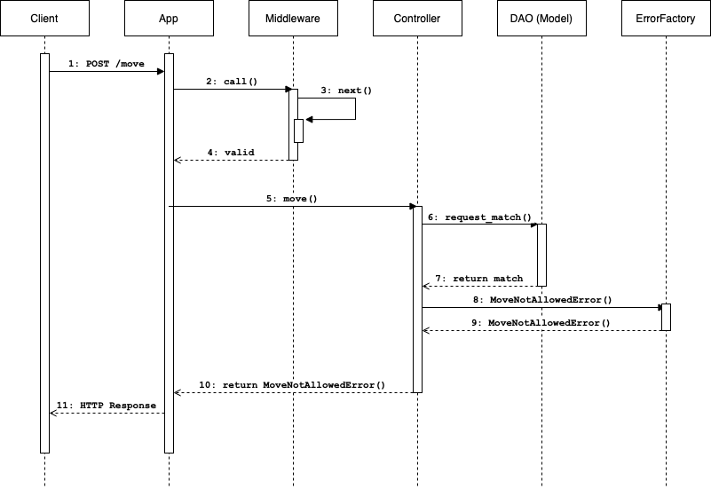</a>

#### ```/playedmatch```  

Nel caso di successo: 

<a></a>

Nel caso di errore:

<a></a>

#### ```/statusmatch```  

Nel caso di successo: 

<a>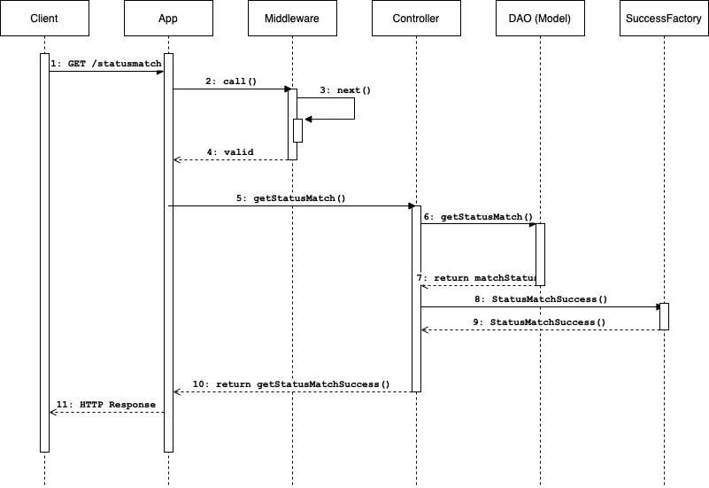</a>

Nel caso di errore:

<a></a>

#### ```/historymoves``` 
Nel caso di successo: 

<a>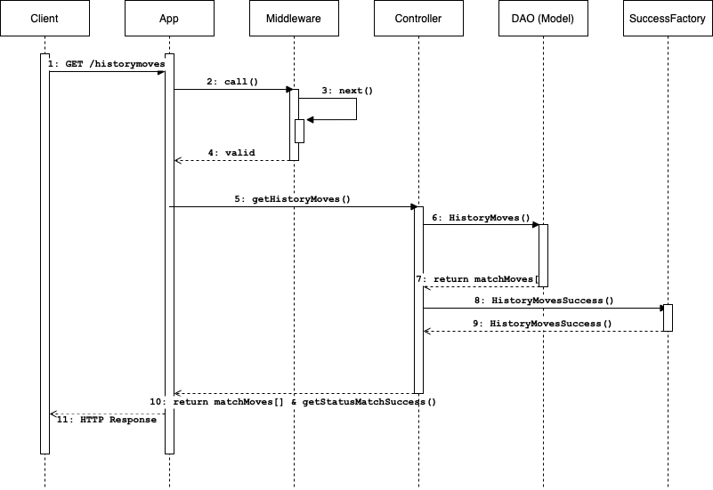</a>

Nel caso di errore:

<a>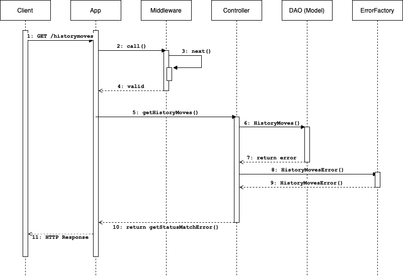</a>

#### ```/playersrank```  
Nel caso di successo: 

<a>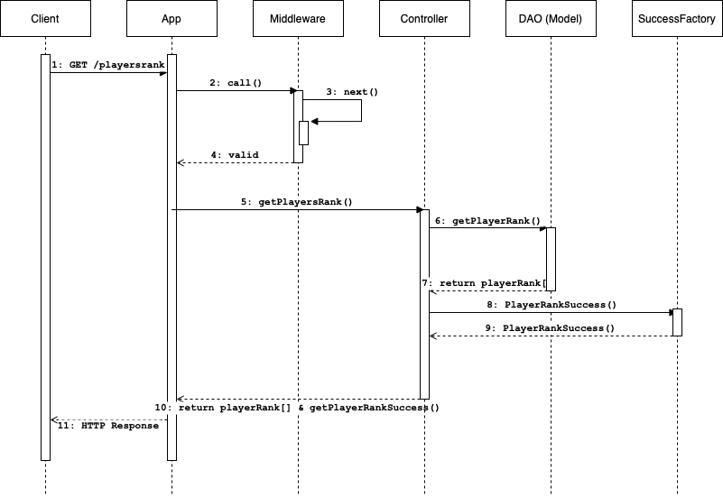</a>

Nel caso di errore:

<a>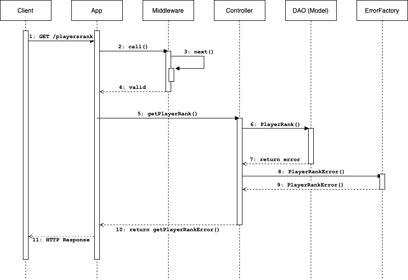</a>

#### ```/token```        
Nel caso di successo: 

<a></a>

Nel caso di errore:

<a></a>

#### ```/token```        
Nel caso di successo: 

<a></a>

Nel caso di errore:

<a></a>

#### ```/endmatch```     
Nel caso di successo: 

<a></a>

Nel caso di errore:

<a></a>


### Pattern utilizzati
- DAO con sequelize per la gestione del modello
- singleton
- mvc
- middleware
- Factory method: è uno dei design pattern fondamentali e rientra nella categoria dei pattern creazionali. Esso indirizza la creazione di oggetti in un unico metodo senza specificare l'esatta classe desiderata. Questo avviene grazie ad una interfaccia per creare un oggetto, ma lascia che le sottoclassi decidano quale oggetto istanziare.
In questo progetto, questo pattern viene utilizzato per la gestione dei messaggi di errori e di successo, con i relativi codici di risposta http. In particolare, è stata realizzata l'interfaccia Message che viene implementata da tutti i messaggi, sia di errore che di successo. Sono state sviluppate poi due classi, ErrorFactory e SuccessFactory, che contengono rispettivamente i metodi getError() e getSuccess() che prendono in input la tipologia di messaggio e restituiscono in output un oggetto della classe di messaggio specificata, contenente cosi anche il codice http associato.
<a>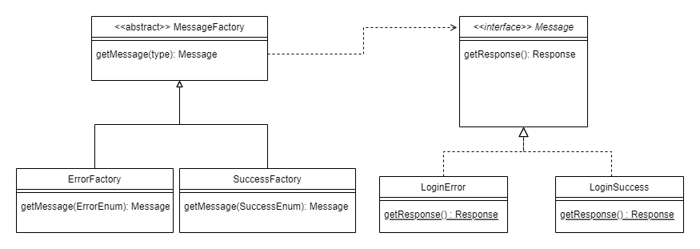</a>

## Funzionalità aggiuntive
### HTTPS

## 🔍 Test
Per testare l'applicazione si può utilizzare la seguente [collection](collection.json) postman inclusa nella repository.
Dato che viene utilizzato l'https, postman restituirà l'errore "SSL Error: Self signed certificate" questo è dovuto al fatto che il certificato è autogenerato. 
Per testare comunque l'applicazione, cliccare su "Disable SSL Verification".

<a>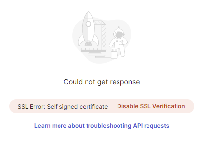</a>

## ✍️ Autori
#### [Manelli Manuel](mailto:s1102514@studenti.univpm.it) (Matricola 1102514) 
#### [Nicolosi Denil](mailto:s1100331@studenti.univpm.it) (Matricola 1100331)

## 🔒 License
MIT License

Copyright © 2022 Denil Nicolosi & Manuel Manelli